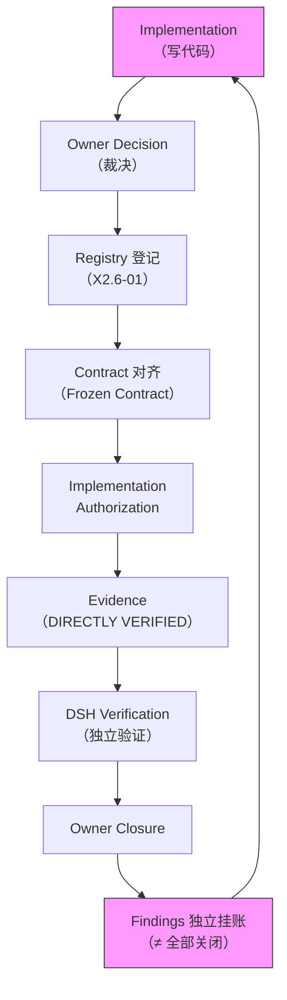
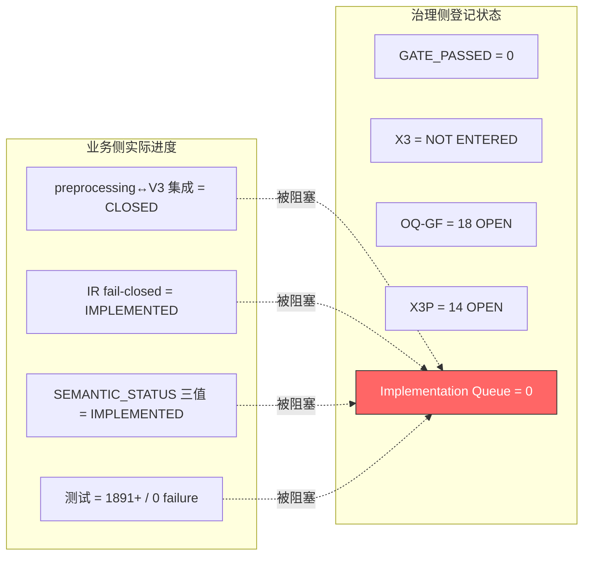

# Governance Simplification & Delivery Unblock Review

**Document Type**: Report / Governance Review（L3，非 normative）
**Status**: `COMPLETE — FOR OWNER REVIEW`
**Date**: 2026-09-23
**Scope**: AITutor-X `Docs/` 全目录（175 份 md）只读审查
**Purpose**: 回答「当前治理是否过度复杂、哪些规则阻塞业务、如何收敛为最小治理模型」
**Method**: 目录全量盘点 + GF/DOC-GOV/X2 系列/OPERATIONS 四路并行规则提取 + 逐条分类
**Explicit Non-Claims**: 本报告不修改 Frozen Spec；不新增 Governance Framework；不关闭任何 OQ/BL/CL/X3P；不创建 Registry/Gate/Contract。结论为 RECOMMENDATION，非 Owner Decision。

---

## Executive Summary

**结论：是的，当前治理体系已经过度复杂，并且正在成为业务推进的主要制约因素。**

核心证据一句话：

> 技术实施面（V3 代码）已推进到可集成、可 fail-closed 的程度（M.2/M.3 已完成、1891+ 测试通过），但治理层把「可实施」与「可进入下一阶段」之间插入了至少 5 层不可跨越的串行闸门，导致 `Implementation Queue = 0`、`OQ-GF = 18 OPEN / 0 CLOSED`、`X3P = 14 全 OPEN`、`GATE_PASSED = 0`。

数字总览：

| 指标 | 数值 | 含义 |
|------|------|------|
| `Docs/` md 文件总数 | **175** | 个人项目 |
| `60_REPORTS/` 文件数 | **104** | 占总量 60% |
| 其中 DSH 对抗审查报告 | **51** | 仅审计/对抗层 |
| 其中 CLOSURE 报告 | **21** | 关闭仪式 |
| 其中 VERIFICATION 报告 | **18** | 验证仪式 |
| OQ-GF 开放问题 | **18 条 / 0 关闭** | 跨 X2→X2.6 全程零关闭 |
| X3P 前置组 | **14 组 / 全 OPEN** | X3 入口永不可满足 |
| P-path 洗白路径 | **13 条 / 仅 4 关闭** | 7 条 production 级 OPEN |
| M-step 实施步 | **10 步 / 仅 1 步 CLOSED** | M.4–M.10 全 NOT STARTED |
| 单个 bug 修复治理事件数 | **6 个**（发现→授权→实施→登记→DSH 验证→Closure） | F-M3-04 实证 |
| Migration 执行权限 | **0**（Charter 未落盘） | 全面禁迁 |

---

## A. 当前 Governance 是否已经过度复杂？

### A.1 回答：YES

判定标准（任务 §19）：「如果现在只有一个人维护这个项目，这条规则是否仍然能够证明它在降低真实工程风险？」

**大量规则的答案是 NO 或 NOT PROPORTIONAL。** 具体证据：

### A.2 证据 1：文档体量与业务代码严重失衡

| 仓库 | 业务代码 | 治理文档 |
|------|---------|---------|
| AITutor-X | `backend/.gitkeep` + `frontend/.gitkeep`（**零业务代码**） | **175 份 md** |
| AITutors-v3 | 有实际 pipeline 代码 | Docs/V3_SPEC（Frozen） |
| Papers | 有 preprocessing 代码 | CURRENT.md 等 |

**AITutor-X 本身是一个纯治理仓库**，其文档量已经超过了它所治理的业务代码量。这是典型的「治理系统比项目本身更复杂」。

### A.3 证据 2：串行审批链使 Implementation Queue 恒为 0

来自 `X2.6-01-PREREQUISITE-REGISTRY.md` 的原话：

> 「全部登记项 OPEN；Owner Decision Required = YES 的项占绝大多数；**可立即实施的纯 D 项 = 0**（在 A/B/C 未裁前）。」

即使 Owner 已经：
- 批准了 D1–D10 语义决策
- 批准了 8×OD
- 发出了 IMPL-AUTH-01 Implementation Authorization
- 关闭了 M.2、M.3、F-M3-04、F-RBC-01、Integration

**Registry 口径下仍然 `Implementation Queue = 0`**，因为「Decision finalization ≠ blocker closure ≠ Implementation Authorization」被刻意解耦为三个独立事件。

### A.4 证据 3：每次 X2.x 阶段都要求完整五件套

| 阶段 | STATE | REGISTRY | EVIDENCE | VERIFICATION | CLOSURE |
|------|-------|----------|----------|-------------|---------|
| X2 | X2-00-STATE | X2-09 / X2-10 | X2-01~08 | 亲验 + git anchor | Stage COMPLETE |
| X2.5 | X2.5-00-STATE | X2.5-01~05 | X2.5-06-EVIDENCE-LINEAGE | DSH 对抗审计 | OWNER-CLOSURE |
| X2.5.1 | X2.5.1-00-STATE | — | X2.5.1-02 | DSH = **FAIL** | 不可关闭 |
| X2.5.2 | X2.5.2-00-STATE | — | X2.5.2-03 | DSH = PASS | Audit Closure only |
| X2.6 | X2.6-00-STATE | **X2.6-01** | X2.6-03 + M1~M3 报告 | 每 M-step 一次 DSH | 多份 Closure |

且明文规定「下一阶段不可在上一阶段 Closure 前启动」，同时「Closure ≠ 下一阶段 ENTERED」——形成**永远差一步**的结构。

### A.5 证据 4：单点修复 = 6 个治理事件

F-M3-04（`ir.py` 一个默认值修复）的完整流程：

```
1. 发现（DSH finding）
2. Owner 任务授权（"F-M3-04 Runtime Correction" 任务书）
3. Claude 实施（commit 637dae7）
4. 状态登记（X2.6-00 §4.24："IMPLEMENTED / AWAITING DSH VERIFICATION"）
5. DSH 独立验证（commit 4d5fd53，VERIFIED）
6. Owner Closure（X2.6-FM304-OWNER-CLOSURE.md，CLOSED）
```

对个人项目而言，一个 bug fix 产生 6 个治理事件 + 2 个 commit + 多份文档更新，**成本远超修复本身**。

---

## B. 哟些规则是真正必要的？（A 类 — HARD ARCHITECTURE CONSTRAINT）

以下规则在单人维护场景下**仍然能证明其降低真实工程风险**，应**KEEP**：

| # | 规则 | 来源 | 保留理由 |
|---|------|------|---------|
| A1 | **Hash-based Source Identity**（Path ≠ Role ≠ Authority） | GF-001 §3 / OD-04 | 防止用目录名/路径冒充数据身份——这是历史真实发生过的问题 |
| A2 | **Fail-closed verification**（hash 不可复算 ⇒ 拒绝） | GF-003 P5 | 防止脏数据静默进入 |
| A3 | **UNKNOWN is retained**（禁 silent skip / fallback） | AGENTS.md 原则 2 / D5 | 防止未识别数据被静默丢弃或洗白 |
| A4 | **Legacy 术语不得作 canonical**（T-2/T-3/T-5） | DOC-GOV §6 | 防止 `standalone_question` 污染 `standalone_unit` 闭集 |
| A5 | **Question Type ⟂ Unit Type**（正交，无映射） | T-4 | 防止错误的 QT→UT 映射导致语义丢失 |
| A6 | **禁止 hardcode secrets** | AGENTS.md / DOC-GOV §12 | 安全基本线 |
| A7 | **不修改 Frozen Spec / Frozen Contract 正文** | R-A / AGENTS.md | 保护核心架构不变量 |
| A8 | **Producer/Consumer 是子系统边界** | AGENTS.md 原则 3 | 防止 preprocessing 与 V3 语义混淆 |
| A9 | **interface_integrity 与 locator_integrity 分列** | GF-002 §9 | 防止「接口对了但来源断了」被误判为可迁 |
| A10 | **禁止 destructive replacement**（preserve legacy + introduce canonical） | D7 | 双字段策略——防止历史数据丢失 |
| A11 | **NAS read-only 数据模式**（禁全量拷入代码仓） | OD-05 | 防止 115G 语料膨胀进 git |
| A12 | **Evidence append-only**（历史不可删） | D3 | 审计追踪基本线 |
| A13 | **禁止为测试通过降低标准或改断言** | D10 / OD-TEST-01 | 防止测试腐化 |
| A14 | **Gate/Admission 不得重释义 Unit-Type** | D9 | 防止下游猜测上游语义 |

**这些是 A 类的核心**：它们直接保护数据完整性、架构边界、安全底线，单人项目也需要。

---

## C. 哪些规则只是 Migration-specific？（B 类 — CHANGE-SCOPE GOVERNANCE）

以下规则**仅在特定变更类型发生时才触发**，不得默认作用于所有开发任务：

| # | 规则 | 来源 | 正确 Scope | 当前问题 |
|---|------|------|-----------|---------|
| B1 | Migration Authority Charter + Gate 1–10 | GF-003 / OD-01 | **仅迁移执行** | 被扩展为所有「进入 active tree」的前置 |
| B2 | EvidencePackage 完整 schema | GF-003 §3 | **仅迁移候选评估** | 被当作普通实现的证据前置 |
| B3 | Cluster A 停止线（默认全面禁迁） | GF-000 §6 / REPORT-I | **仅数据/资产迁移** | 被解读为 X3 入口也全禁 |
| B4 | Artifact Registry + OD-06 四步 admission | OD-10 / OD-06 | **仅治理工件准入** | 被扩展为所有文档的 authority 前置 |
| B5 | Difference Ledger + 87/71/166 引用纪律 | OD-18 | **仅迁移 lineage 主张** | 被扩展为所有数字引用义务 |
| B6 | 测试基线受控重跑（F9） | GF-003 / OQ-018 | **仅「迁移后测试等价」声明** | 被当作测试工作的前置 |
| B7 | NAS mount/schema/权限/备份实施 | OD-05 / OQ-002 | **仅数据交付** | 被当作数据相关开发的前置 |
| B8 | Root 文件迁移 11 件套 | DOC-GOV §7.2 | **仅 root 报告挪移** | PLAN ONLY 卡在 Owner 批准 |
| B9 | 双树保留策略（OQ-004） | GF-005 | **仅删除/合并数据树** | 被当作所有数据操作的前置 |
| B10 | C-1~C-5 强制授权条件 | IMPL-AUTH-01 | **仅 X2.6 已授权的 M-step** | 被当作后续所有实现的持续约束 |

**核心问题：B 类规则的 Scope 被系统性扩大了。** 迁移治理被自动套用到普通 Integration / Implementation。

---

## D. 哪些规则正在阻塞普通业务开发？（必须给出具体文档和规则）

### D.1 具体阻塞案例

#### 案例 1：`reslice_pipeline.py` 增加 `source_content_sha256` 输出

**业务需求**：FORMAL-E2E-05 显示 Path B 在 CONSUMER 层因 `MISSING_IDENTITY` 失败，修复方法是让 preprocessing 正式入口输出 `source_content_sha256`。

**被什么阻塞**：
- 需确认是否「改变核心 Contract」→ 触发 Owner Decision
- 需确认是否「创造新的 architecture fact」→ DOC-GOV Creation Gate 9 项
- 需确认 mapping 语义 → OD-MAP-01 event-id 机制缺位（F-05-A = IMPLEMENTATION GAP）
- 需确认是否需 Spec Change → Frozen Spec 修正被冻结在 6 步流程外

**实际上**：这只是让 preprocessing 输出一个已经存在于 Contract 中的字段（`source_content_sha256` 是 Contract v0.2 已定义的 Identity Authority），是**完成已经明确的 Frozen Spec 实现**（任务 §9 允许直接实施），却需要穿越至少 4 层治理确认。

**来源**：`X2.6-01-PREREQUISITE-REGISTRY.md` X3P-01；`X2.6-03-IMPLEMENTATION-TRACKING-MATRIX.md` F-05-A

#### 案例 2：P3/P4/P5/P9/P10/P11 wash path 修复

**业务需求**：`compile/ir.py:108` 默认值 → standalone_question 的洗白路径，以及 `gate/service.py:335` passthrough、`gate/payload.py:274` display else 等 7 条 production 级 wash path。

**被什么阻塞**：
- 属 production 域，须逐项 Owner 授权才可动
- 矩阵自认「P3/P9 的测试已呈现 CORRECTED 断言，但本矩阵行未随之更新——该记账陈旧属 M.3 轮遗留，**本轮不越权清理**」
- 技术上已处理的项因「不自动关闭」规则挂账

**来源**：`X2.6-03-IMPLEMENTATION-TRACKING-MATRIX.md` §2 + §2 注

#### 案例 3：M.4–M.10 全部 NOT STARTED

**业务需求**：Gate closed-set enforcement、Admission fail-loud、Evidence end-to-end、Papers guard、DI-01 isolation、Material compat、Tests/provenance——全部是 pipeline 需要的。

**被什么阻塞**：每个 M-step 需要**独立的 Owner task authorization**。「Next actor = Owner（implementation authorization）」。

**来源**：`X2.6-03` M-Step 表；`X2.6-00-STATE.md` §7

#### 案例 4：40_DECISIONS/ 填充被 OQ-016 阻塞

**被什么阻塞**：DEC/BUG/OQ namespace 政策未裁（OQ-GF-016 = OPEN-BLOCKING）。**连写一条决策记录都需要等 namespace 政策**。

**来源**：GF-005 OQ-016；X2-06 §7

#### 案例 5：任何新文档创建需过 9 项 Creation Gate

**被什么阻塞**：DOC-GOV §4——任一答不出 → 不得创建。这包括「是否创造新的 architecture fact → YES 需 Owner authority」。

**影响**：写一份 bug 修复报告都需要过 9 项检查。

**来源**：`AITUTORX-DOC-GOVERNANCE.md` §4

### D.2 阻塞规则汇总表

| 阻塞规则 | 文档位置 | 阻塞对象 | 分类 |
|----------|---------|---------|------|
| Charter 未落盘 ⇒ 一切 Gate 9 无效 | GF-003 §3.2.2 | 全部迁移 | B（scope 过大） |
| OQ-016 namespace 未裁 | GF-005 | 40_DECISIONS 填充 | D（不必要） |
| Document Creation Gate 9 项 | DOC-GOV §4 | 任何新文档 | C（应降级） |
| 每 M-step 独立 Owner 授权 | X2.6-03 | M.4–M.10 | D（不必要） |
| Decision ≠ Closure ≠ Authorization 解耦 | X2.6-01 §10 | 所有实现 | D（不必要） |
| 矩阵记账不越权清理 | X2.6-03 §2 注 | 陈旧记录 | D（不必要） |
| 7 条 production wash path 需逐项授权 | X2.6-03 §2 | bug fix | B（scope 过大） |
| 87/71/166 引用须关联 disposition | OD-18 / X2-07 §4 | 文档数字引用 | C（应降级） |
| Frozen Spec 修正须 6 步流程 | Spec Change 流程 | 已知 SPEC ERROR | B（scope 过大） |
| 每 Closure 附带"不等于"清单 | X2.6-00 §4.26 | 永远有 OPEN finding | D（不必要） |

---

## E. 是否存在 Governance Dependency Cycle？

### E.1 回答：YES — 存在近似循环



**循环路径**：Implementation → Decision → Registry → Contract → Authorization → Evidence → Verification → Closure → **Findings 挂账** → 回到 Implementation（因为 findings 又需要新的 Implementation）。

### E.2 治理递归（规则依赖规则）

```
规则 A（DOC-GOV Creation Gate）要求：
  → 回答「是否创造 architecture fact」
    → 如 YES，需 Owner authority（规则 B）
      → Owner authority 来自 GF-006（规则 C）
        → GF-006 要求「不自行新增 Owner Decision」（规则 D）
          → 又需 Owner 任务授权（回到规则 B 的前置）
```

### E.3 术语治理递归

```
新术语被 ≥2 文档使用（R-E）
  → 必须在 L0-SPEC 定义
    → 修改 L0-SPEC 需 Owner Decision + explicit amendment（R-A）
      → Owner Decision 需记录在 40_DECISIONS
        → 40_DECISIONS 填充被 OQ-016 阻塞
          → OQ-016 需 Owner Decision
            → 循环
```

**结论：治理体系正在因为自身的复杂性不断制造新的文档依赖。**

---

## F. 是否存在 Governance-Induced Delivery Blockage？

### F.1 回答：YES — 有真实案例

#### 真实案例 1：「Implementation Queue = 0」的悖论

**事实**（`X2.6-01` §3/§5/§10）：
- Owner 批准了 D1–D10 → Implementation Queue = 0
- Owner 批准了 8×OD → Implementation Queue = 0
- Owner 发出了 IMPL-AUTH-01 → Implementation Queue = 0
- M.2 完成 → blockers 仍 ALL OPEN
- M.3 完成 → blockers 仍 ALL OPEN
- F-M3-04 关闭 → blockers 仍 ALL OPEN

**原因**：「Decision finalization ≠ blocker closure ≠ Implementation Authorization」被刻意解耦。每关闭一个事件，立即产生新的「不等于」声明。

#### 真实案例 2：M.4-M.10 停摆

M.2（SEMANTIC_STATUS 三值化）和 M.3（Question/Unit boundary）已完成并 CLOSED。M.4–M.10（Gate enforcement、Admission fail-loud、Evidence chain、Papers guard、DI-01、Material、Tests）**全部 NOT STARTED**，原因是「每个 M-step 需要独立的 Owner task authorization」。

但这些步骤的**技术依赖已经满足**（M.2/M.3 已 CLOSED），纯粹是治理流程卡住了。

#### 真实案例 3：已知 SPEC ERROR 不能修

Frozen Spec 20 §4.5/§6.1 已确认 SPEC ERROR（`standalone_question` → `standalone_unit`），Corrections PROPOSED 但「Frozen Spec modified = NO」、「AWAITING OWNER REVIEW」、须走 6 步 Spec Change 流程。

**已知错误不能修，只能 divergence registration。**

#### 真实案例 4：矩阵陈旧记录不能清理

`X2.6-03` §2 注明文：

> 「P3/P9 的测试已呈现 CORRECTED 断言，但本矩阵行未随之更新——该记账陈旧属 M.3 轮遗留，**本轮不越权清理**，已提交 DSH/Owner 知悉。」

**治理纪律本身制造文档-现实漂移，且漂移不可在实施层修复。**

### F.2 阻塞结构图



---

## G. 哪些文档可以 Merge / Downgrade / Archive？

### G.1 处理原则

每个治理规则只能采取：KEEP / MERGE / DOWNGRADE / SCOPE-LIMIT / ARCHIVE / DELETE。**CREATE 默认禁止。**

### G.2 60_REPORTS/（104 份）

| 动作 | 文档 | 理由 |
|------|------|------|
| **ARCHIVE** | 全部 51 份 `*DSH-ADVERSARIAL-REVIEW.md` / `*DSH-VERIFICATION*.md` | 历史审计证据。保留可追溯性，但不应作为当前实施前置 |
| **ARCHIVE** | 全部 21 份 `*CLOSURE*.md`（已关闭事项的关闭记录） | Historical Evidence ≠ Current Prerequisite |
| **ARCHIVE** | X2/X2.1/X2.5/X2.5.1/X2.5.2 时代的报告（REPORT-A~K、X2-DSH-*、X2.5-*、X2.5.1-*、X2.5.2-*） | 已完成历史阶段的审计结果 |
| **KEEP** | FORMAL-E2E-04/05 报告 + ENABLEMENT 系列 | 当前业务管线的最新 evidence |
| **KEEP** | REPORT-L-LLM-PROVIDER-CONFIG-CLOSURE | 当前有效配置证据 |
| **KEEP** | X2.6-INT-01 / X2.7-INT-FULL-01 | preprocessing↔V3 集成证据 |
| **MERGE** | OD-01 系列 7 份 DSH 审查（V2/V3/V4/V4R/R2/R3） | 同一问题的多轮审查可合并为一份终态摘要 |
| **MERGE** | OD-R-01 系列 10 份 DSH/Closure | 同上 |

### G.3 00_GOVERNANCE/（8 份 + REVIEW/）

| 动作 | 文档 | 理由 |
|------|------|------|
| **KEEP** | GF-000（基线总述） | 合并 GF-001~004 中重复的 Freeze≠Auth 声明到 GF-000 单点 |
| **KEEP** | GF-001（Source Authority） | A 类硬规则载体 |
| **KEEP** | GF-002（Lineage） | A 类硬规则载体 |
| **SCOPE-LIMIT** | GF-003（Evidence Contract） | **明确 Scope = 仅迁移候选评估**，不适用于普通实现的证据前置 |
| **SCOPE-LIMIT** | GF-004（Migration Boundary） | **明确 Scope = 仅资产迁移**，不适用于普通 Integration |
| **KEEP** | GF-005（OQ Registry） | 但需建立简化关闭协议（见 Deliverable 2） |
| **MERGE** | GF-006（Owner Decision Record）→ 并入 GF-000 | 8 条 OD 的 Non-authorizations 与 GF-000~005 正文大量重叠 |
| **DOWNGRADE** | AITUTORX-DOC-GOVERNANCE | Creation Gate 9 项 → 3 项；Root Rule 保留；读取顺序降为建议 |
| **ARCHIVE** | REVIEW/ 子目录全部 | 历史设计过程稿 |

### G.4 10_SPEC/ + 20_ARCHITECTURE/（15 份）

| 动作 | 文档 | 理由 |
|------|------|------|
| **KEEP** | X2-03（Concept Terminology Map） | 术语定义正典 |
| **KEEP** | X2.5-02（Concept Matrix） | 术语边界 |
| **MERGE** | X2-05（Unified Documentation Map）→ 并入 DOC-GOV | 文档映射是治理元数据 |
| **ARCHIVE** | X2-01 / X2-02（System/Architecture Baseline） | X2 期审计快照 |
| **ARCHIVE** | X2.5-01（Pre-Migration Baseline） | 历史事实库 |
| **ARCHIVE** | X2.5.1-01（Corrections） | 已执行的更正 |
| **ARCHIVE** | X2.5.2-01/02（Unit-Type Audit / Authority Map） | 审计已完成 |
| **KEEP** | X2.6-COMPLETE-MODIFICATION-DESIGN | 当前设计参考 |
| **ARCHIVE** | X2.6-UQ-03/04/06（Pipeline Audit / Provenance / Material Impact） | 分析已完成 |
| **KEEP** | X2.6-UQ-08（Semantic Test Spec） | 测试规格，当前有效 |

### G.5 30_CONTRACTS/（2 份）

| 动作 | 文档 | 理由 |
|------|------|------|
| **ARCHIVE** | X2-04（Cross-System Contract Audit） | 历史审计 |
| **ARCHIVE** | X2.5-03（Producer-Consumer Audit） | 历史审计 |

### G.6 40_DECISIONS/（22 份）

| 动作 | 文档 | 理由 |
|------|------|------|
| **KEEP** | X2.6-UQ-01-UNIT-QUESTION-SEMANTIC-DECISION（D1–D10） | 当前有效语义决策 |
| **KEEP** | X2.6-OD-FINAL-01（8×OD） | 当前有效 Owner Decision |
| **KEEP** | X2.6-IMPL-AUTH-01 | 最近的 Implementation Authorization |
| **KEEP** | X2.6-IMPLEMENTATION-PLAN | 实施参考 |
| **MERGE** | X2.6-OD-1-DI01 / OD-2-MAPPING / OD-F01-01 → 并入 OD-FINAL-01 附录 | 已裁决的单项决策 |
| **MERGE** | X2.6-BASELINE-CLOSURE / FM304-CLOSURE → 并入 50_OPERATIONS 状态文件 | Closure 是状态不是决策 |
| **ARCHIVE** | X2-06（Decision Mapping） | 历史 ID 映射，保留参考 |
| **ARCHIVE** | X2-07（Difference Ledger） | 引用纪律已在 GF-002/OD-18 中 |
| **ARCHIVE** | X2-08（Migration Candidate Registry） | 迁移候选登记，GATE_PASSED=0 的历史快照 |
| **ARCHIVE** | X2.5-04/05 / X2.5-CLOSURE-03 / X2.5.1-03 / X2.5.2-04 | 历史冲突更新 |
| **ARCHIVE** | X2.6-M1-01/02 / X2.6-DSH-CORRECTION-01 | 历史调查/更正 |
| **ARCHIVE** | X2.6-RESIDUAL-OWNER-DECISION-RESOLUTION | 被 OD-FINAL-01 取代 |

### G.7 50_OPERATIONS/（17 份）

| 动作 | 文档 | 理由 |
|------|------|------|
| **KEEP** | X2.6-00-STATE | 当前状态 |
| **KEEP** | X2.6-01-PREREQUISITE-REGISTRY | 但需按 Deliverable 2 简化 |
| **KEEP** | X2.6-03-IMPLEMENTATION-TRACKING-MATRIX | 但需清理陈旧记录 |
| **MERGE** | X2-00-STATE / X2.5-00-STATE / X2.5.1-00-STATE / X2.5.2-00-STATE → 并入 ARCHIVE | 历史阶段快照 |
| **MERGE** | X2-09 / X2-10 / X2.5-06 / X2.5-07 / X2.5-CLOSURE-04 → 并入 ARCHIVE | 历史 open issues / readiness |
| **MERGE** | X2.6-02（X2.5 Closure Registration）→ 并入 X2.6-00-STATE | 补登记录 |
| **ARCHIVE** | X2.5.1-02 / X2.5.2-03 / X2.6-UQ-07 | 历史审计/处理记录 |
| **ARCHIVE** | X2.5-OWNER-CLOSURE-02-X3-HANDOFF | 历史交接 |

### G.8 汇总

| 动作 | 数量 | 说明 |
|------|------|------|
| KEEP | ~15 份 | 当前有效规则/状态/证据 |
| MERGE | ~20 份 | 并入 KEEP 文档 |
| SCOPE-LIMIT | ~4 份 | 明确只在特定场景生效 |
| DOWNGRADE | ~2 份 | 从强制降为建议 |
| ARCHIVE | ~130+ 份 | 移入 90_ARCHIVE/，保留可追溯性 |
| DELETE | 0 | 不删除历史 |

---

## H. 哪些规则必须保留？

（与 B 节 A 类一致，此处补充理由）

| 规则 | 保留理由 | 如果删除的后果 |
|------|---------|--------------|
| Hash-based Identity | 历史真实发生过 path 冒充 identity 的问题（FORMAL-E2E-05 MISSING_IDENTITY） | 数据身份不可信 |
| Fail-closed | hash 不一致时静默放行 = 脏数据入库 | 数据完整性崩溃 |
| UNKNOWN retained | silent fallback = 未识别数据被洗白（P-path 问题的根源） | 数据质量不可控 |
| Legacy 术语边界 | `standalone_question` 混入 `standalone_unit` 闭集 = 语义混乱 | 下游语义错误 |
| 不改 Frozen Spec | 核心架构保护 | 架构漂移 |
| Secrets 管理 | 安全 | 泄密 |
| Evidence append-only | 审计 | 证据被篡改 |
| 禁改测试断言 | 测试可信度 | 测试腐化 |
| NAS read-only | 115G 语料不入 git | 仓库膨胀 |
| QT ⟂ UT | 防止错误映射 | 语义丢失 |

---

## I. 最终建议的最小治理模型

见 Deliverable 2：`RECOMMENDED-MINIMAL-GOVERNANCE-MODEL.md`。

核心收敛为三档：

```
LEVEL 1 — NORMAL IMPLEMENTATION（默认，直接做）
LEVEL 2 — ARCHITECTURAL CHANGE（需 Owner Decision）
LEVEL 3 — MIGRATION / IRREVERSIBLE CHANGE（严格治理）
```

不再增加第四级。

---

## 附录：判断标准回答

> 「如果现在只有一个人维护这个项目，这条规则是否仍然能够证明它在降低真实工程风险？」

| 规则群 | 回答 | 处理 |
|--------|------|------|
| Hash identity / fail-closed / UNKNOWN / 术语边界 / Frozen 保护 | **YES** | KEEP |
| Migration Gate 1–10 / EvidencePackage / Charter | **仅迁移时 YES** | SCOPE-LIMIT |
| DSH 对抗审查 / Closure 仪式 / 每步 Owner 授权 | **NO（单人时过重）** | DOWNGRADE 或 MERGE |
| Creation Gate 9 项 / 数字引用纪律 / 读取顺序 | **NO（文档形式）** | DOWNGRADE |
| Freeze≠Auth 重复声明 / Citation state 三处重复 | **NO（冗余）** | MERGE |
| OQ 零关闭纪律 / Findings 永久挂账 / 矩阵不越权清理 | **NO（制造阻塞）** | DELETE（规则本身） |

---

*本报告为 RECOMMENDATION，不构成 Owner Decision。不修改任何 Frozen Spec。不关闭任何 OQ/BL/CL/X3P。历史报告保留为 Historical Evidence，明确 ≠ Current Implementation Prerequisite。*
